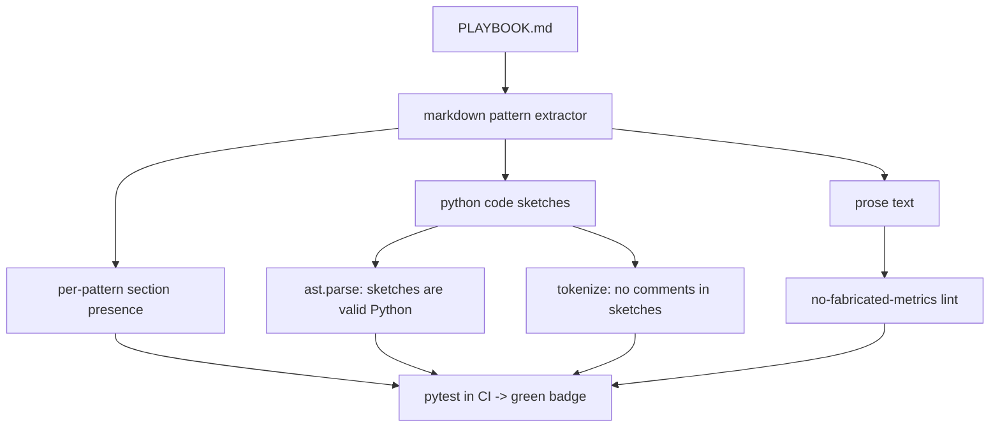

# AI Retrofit Playbook

[](https://github.com/amin-ale/ai-retrofit-playbook/actions/workflows/ci.yml)
[](LICENSE)
[](pyproject.toml)

**Seven patterns for adding an LLM feature to software that already has users, a schema, an auth model, and a budget.** The brief is "ship an AI feature into a running product without regressing anything that currently works." That is the hard version of the job, a long way from "build a chatbot in an afternoon." It covers the architecture fork (sidecar vs in-process), runtime behavior (streaming, caching tiers), and the disciplines that keep you from getting paged or fired (eval-gated deploys, fallback UX, cost guardrails, vendor-lock hedging). Each pattern says when to use it, when not to, tells an archetypal failure story, and shows a comment-free code sketch of the shape of the fix. Judgment-heavy, zero fluff, no fabricated numbers.

The playbook itself lives in **[PLAYBOOK.md](PLAYBOOK.md)**. This README is the framing and the reason the repo has a green check.

## Why this repo has tests

A patterns document is usually where code goes to rot: the prose drifts, the sketches stop parsing, someone pastes a comment into an example that's supposed to be comment-free. The CI here treats the playbook as a build artifact. A test suite parses `PLAYBOOK.md` and enforces that:

- every pattern has its required sections (**Use it when** / **Skip it when** / **The burn** / a code sketch / **The judgment call**),
- every Python code sketch actually parses (`ast.parse`), so no sketch can bit-rot into something that isn't valid Python,
- no code sketch contains comments (checked with `tokenize`), because the sketches are meant to be self-explanatory,
- the document makes no fabricated statistical claims: a lint flags bare percentages, `Nx` multipliers, and currency figures in the prose so any future edit that smuggles in an unsupported metric fails the build.

So the green badge means the doc is structurally sound and its code examples are real. It doesn't mean a program does something at runtime. This is a judgment artifact with a linter.

## Architecture



## Quickstart

There is nothing to install to *read* the playbook. Open [PLAYBOOK.md](PLAYBOOK.md).

To run the checks that keep it honest:

```bash
uv venv --python 3.12
uv pip install -e ".[dev]"
uv run pytest -q
```

## Running the tests

```bash
uv run pytest -q
```

The same command runs in CI on every push and pull request (see `.github/workflows/ci.yml`). It reads `PLAYBOOK.md` from the repo root and validates it. No network, no API keys, no external services. The suite is fully offline and finishes in seconds.

## Notable decisions

- **The playbook is the product; the code is the guardrail.** The valuable artifact is the judgment in `PLAYBOOK.md`. The Python exists only to keep that document structurally sound and its examples real as it gets edited over time.
- Failure stories are archetypal and labeled as such, composites of common retrofit mistakes rather than incident reports. The document claims no measured statistics; any number in a sketch is a configuration value you set.
- Python 3.12 is the target: the suite is stdlib-only for parsing (`ast`, `tokenize`, `re`) so it runs anywhere, and 3.12 is pinned for a stable `tokenize`/`ast` surface.

## Hire me

I retrofit AI features into products that already have users, the part the demo-builders skip. If your existing app needs an LLM feature that doesn't take down everything around it, let's talk: [https://amin-ale.github.io/portfolio-site](https://amin-ale.github.io/portfolio-site) or [amin.ale.business@gmail.com](mailto:amin.ale.business@gmail.com).
